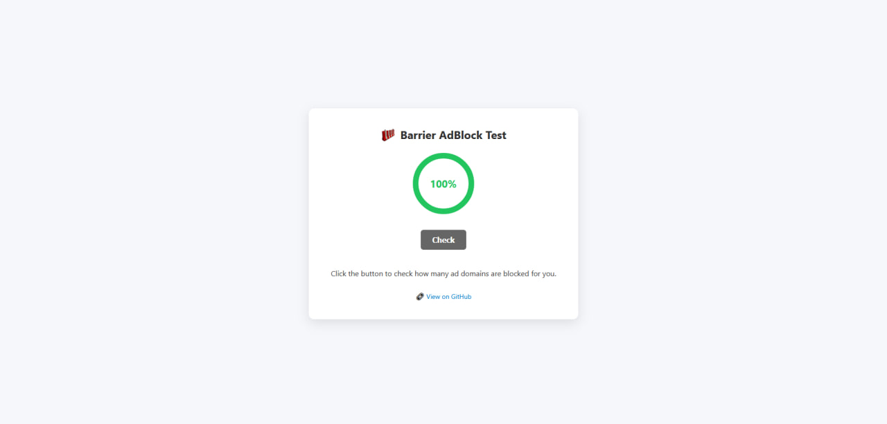
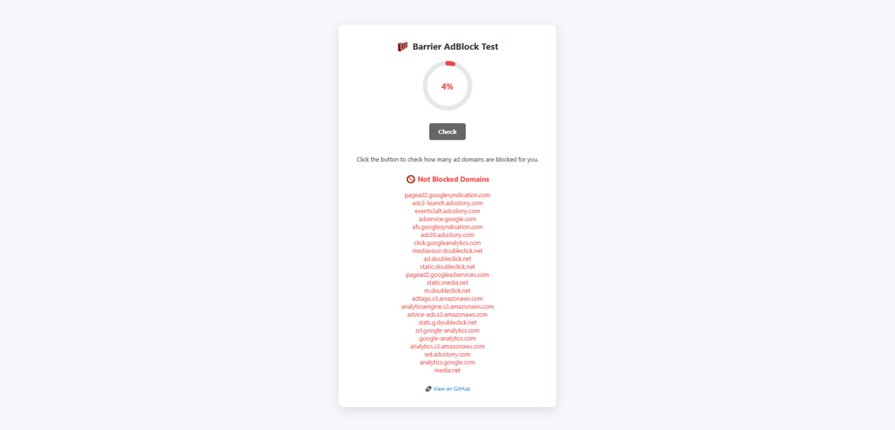

# Barrier AdBlocker Test

  

## Ad Block Test  [Link](https://ilalutovinov.github.io/Barrier-AdBlocker-Test/)
This tool allows you to check if your adblock solution is blocking enough hosts. With a simple UI and easy UX you can check how much you have blocked. The tool tries to connect to the most common domains for different categories (ads, analytics, bug tracking, social trackers, mix and OEMs).

If you don't block all the hosts but you want to , you can use
- My hosts txt list -> [hosts-list.txt](https://github.com/ilalutovinov/Barrier-AdBlocker-Test-/blob/main/hosts-list.txt)

