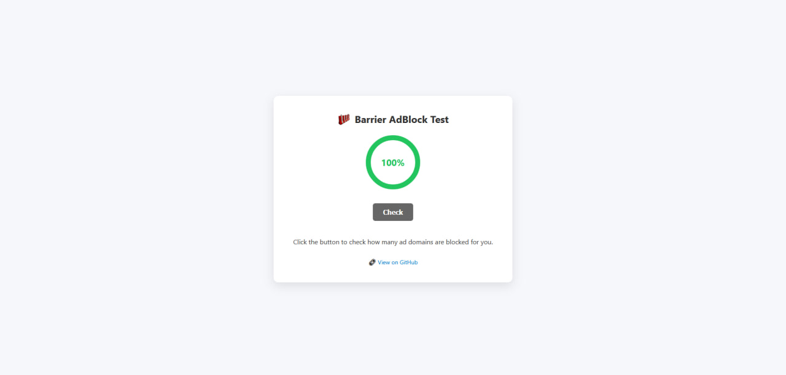
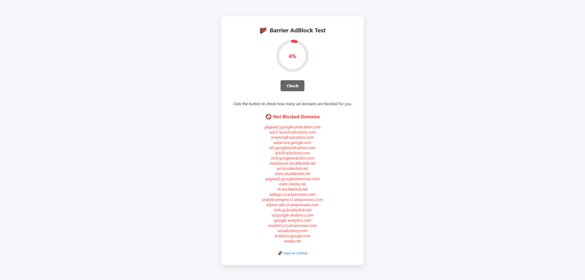

# [Barrier AdBlocker Test](https://ilalutovinov.github.io/Barrier-AdBlocker-Test/) 

 [](https://github.com/creativetimofficial/vision-ui-dashboard-chakra/issues?q=is%3Aopen+is%3Aissue) [](https://github.com/creativetimofficial/vision-ui-dashboard-chakra/issues?q=is%3Aissue+is%3Aclosed)

  

## 📌 Project Description

<p>
&nbsp;
&nbsp;
&nbsp;
</p>

**Barrier AdBlocker Test** is a simple web tool for checking the effectiveness of ad and tracker blocking in your browser or local network (such as extensions, Pi-hole, or DNS-based filters). 

It helps to determine how many unwanted domains are actually being blocked by your system. This can be useful for:

- Regular users who want to know if their AdBlock is working;
- System administrators and enthusiasts configuring local filters (e.g., Barrier, Pi-hole, AdGuard Home);
- Testing DNS blocking or proxy filters.

If you don't block all the hosts but you want to, you can use:
- My custom hosts list → [hosts-list.txt](https://github.com/ilalutovinov/Barrier-AdBlocker-Test-/blob/main/hosts-list.txt)




- The final percentage and a list of unblocked domains, if any, are displayed.

### ⚠️ Important: Limitations

> This tool is **not a perfect diagnostic method**. It cannot guarantee 100% accuracy:
>
> - Browsers may cache responses or handle `no-cors` requests differently.
> - Some domains may be blocked at the IP level, which is not always detectable.
> - A request might succeed even if the actual ad content is blocked by other filters.
>
> Nevertheless, it’s a **convenient and fast way** to evaluate the effectiveness of your ad and tracker blocking.

---

### 🧠 How It Works

- The interface is built using **HTML** and **CSS**.
- All detection logic is implemented in **JavaScript** (`script.js`), which includes a list of known advertising and analytics domains.
- When you press the **Check** button, the script sends `HEAD` requests to these domains:
  - If the request fails (blocked) — the domain is considered **blocked**.
  - If the request succeeds — the domain is **not blocked**.
- After the test:
  - A blocking percentage is displayed.
  - A circular progress bar animates.
  - A list of unblocked domains is shown if applicable.


## 📁 Project Structure

```bash
Barrier-AdBlocker-Test/           # Main project folder
│
├── index.html                    # Main HTML page (one page site)
├── style.css                     # Page styling
├── script.js                     # Ad Blocking Test Logic
├── logo.png                      # Header logo
├── README.md                     # Project documentation
├── images/                       # Screenshots for README
│   ├── logo.png              # Logo for README
│   ├── screenshot1.jpg       # Screenshot
│   ├── screenshot2.jpg       # Screenshot
│   └── screenshot3.jpg       # Screenshot
└── .gitignore                   # Git ignore rules
```
